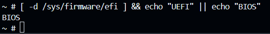
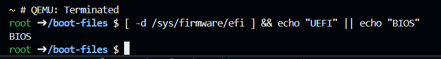
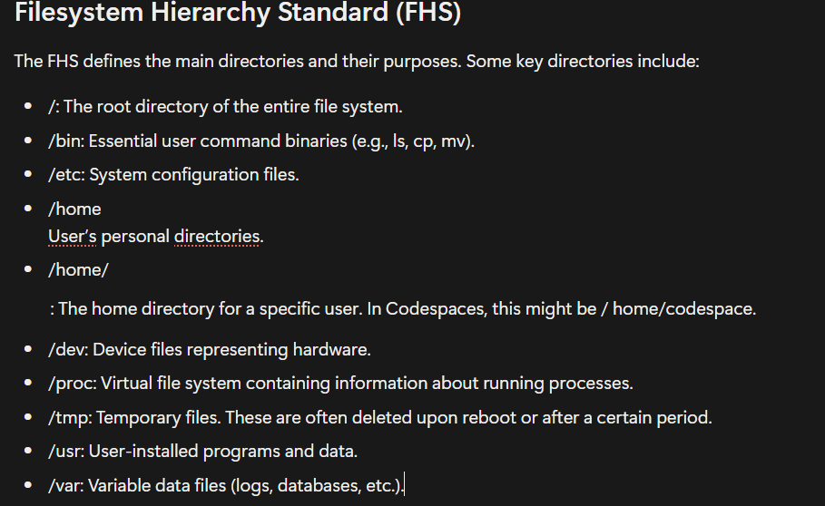
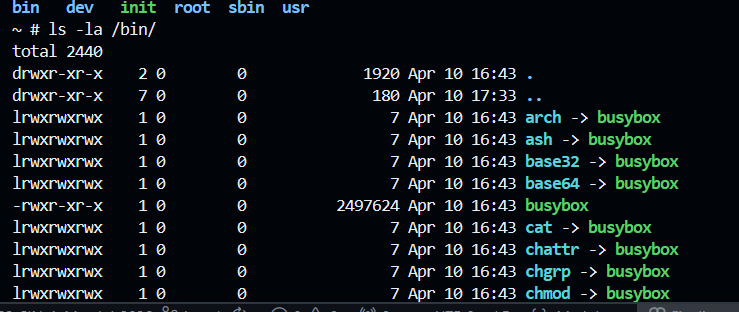
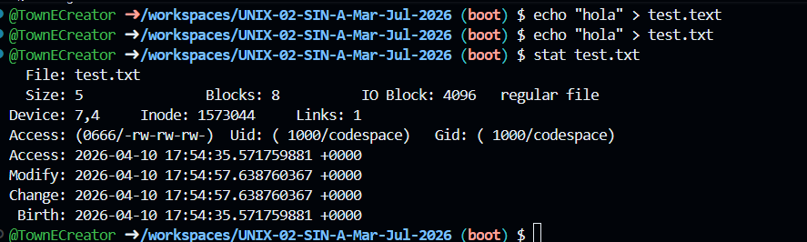
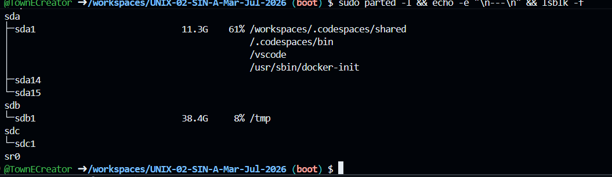

# UNIX-02-SIN-A-Mar-Jul-2026
Repo for intro to UNIX

Question Section
Vericar el tipo de rmware: Ejecuta [ -d /sys/firmware/efi ] && echo "UEFI" || echo "BIOS" tanto en el Codespace como dentro de QEMU. ¿Qué resultado obtienes y por qué?

QUEMU

Codespaces

As seen, in both Codespaces and the QUEMU it is returned "BIOS", because neither environment is actually booting with UEFI firmware. In codespaces the system runs isnide a container that does not expose real firmware, similar in QEMU, unless explicitly configured to use UEFI firmware such as OVMF, it defaults to legacy BIOS.

. Inspeccionar la estructura: Dentro de QEMU, ejecuta ls / y compara con la estructura de
directorios que vimos en clase. ¿Qué directorios faltan y por qué?

Inside the QEMU environment, only these directories appear (`/bin`, `/dev`, `/init`, `/root`, `/sbin`, `/usr`) because the system is running from a very basic initramfs built with BusyBox rather than a full Linux filesystem. Several standard directories defined by the FHS}, such as `/etc`, `/home`, `/proc`, `/tmp`, and `/var`, are missing because they were not created or mounted. This minimal environment is designed only to boot the kernel and provide a shell, so it includes only essential components. For example, `/proc` is absent because it is a virtual filesystem that must be mounted manually, while directories like `/home`, `/var`, and `/tmp` are unnecessary since there are no users, services, or applications requiring them.

. Explorar BusyBox: Dentro de QEMU, ejecuta ls -la /bin/ y observa que todos los comandos
son enlaces simbólicos al mismo binario. ¿Qué ventaja tiene esto para un sistema embebido?

The advantage that this has relies on the rediction of disk space usage becuase instead of storing separate binaries for each command, all functionality is bundled into one compact file. And for embedded systems, where resources are limited, this is a major advantage, as it reduces the fotprint, simplifying the deployment and reducing overhead while still providing essential utilities.

. Examinar bloques: En el Codespace, crea un archivo con echo "hola" > test.txt y luego
ejecuta stat test.txt . Identica el tamaño real vs. los bloques asignados. ¿Hay
fragmentación interna?

The file `test.txt` has a **real size of 5 bytes**, which corresponds to the text `"hola"` plus the newline character added by `echo`. However, the `stat` output shows that **8 blocks of 512 bytes each are allocated**, meaning a total of **4096 bytes (4 KB)** are reserved on disk. This happens because the filesystem allocates space in fixed-size blocks (in this case, 4 KB), even if the file is much smaller. As a result, there **is internal fragmentation**, since most of the allocated space (4096 bytes) is unused while the file only needs 5 bytes.

. Analizar particiones: Ejecuta sudo parted -l && echo -e "\n---\n" && lsblk -f
en el Codespace. Identica qué discos usan GPT vs MBR, y qué lesystems están en uso

From the output, we can identify both the partition types and filesystems used:

The system has three main disks: `/dev/sda`, `/dev/sdb`, and `/dev/sdc`. Disk `/dev/sda` uses a GPT (GUID Partition Table) and contains multiple partitions, including a small BIOS boot partition, a FAT32 EFI partition, and a main ext4 partition. Disk `/dev/sdb` uses an MBR (msdos) partition table and has a single primary partition formatted as ext4. Disk `/dev/sdc` also uses GPT and contains one large partition formatted as ext4. According to `lsblk`, the filesystems currently in use are mainly ext4, which is the standard Linux filesystem, and fat32, which is used for the EFI boot partition. Additionally, several loop devices are mounted, which are used internally by the system (for containers or virtualized storage), but they do not represent physical disks.
